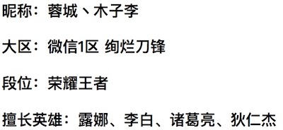

Vue.js 使用了基于 HTML 的模版语法，允许开发者声明式地将 DOM 绑定至底层 Vue 实例的数据。

Vue.js 的核心是一个允许你采用简洁的模板语法来声明式的将数据渲染进 DOM 的系统。

结合响应系统，在应用状态改变时， Vue 能够智能地计算出重新渲染组件的最小代价并应用到 DOM 操作上。

# # 插值

## 1、文本

数据绑定最常见的形式就是使用 {{...}}（双大括号）的文本插值：

```html
<div id="app">
    <!--方法1-->
    <h3>昵称：{{ username }}</h3>
    <!--方法2-->
    <h3>大区：<span v-text="area"></span></h3>
    <!--方法3-->
    <template>
        <h3>段位：{{ rank }}</h3>
        <h3>擅长英雄：{{ heros }}</h3>
    </template>
</div>
```

```javascript
var app = new Vue({
    el: "#app",
    data: {
        username: "蓉城丶木子李",
        area:"微信1区 绚烂刀锋",
        rank:"荣耀王者",
        heros:"露娜、李白、诸葛亮、狄仁杰"
    }
});
```



> 代码解读：
>
> 1）、使用vue，需通过id设置vue的挂载器，该id值可自行定义，在js中，创建vue对象时 `el` 的值必须和 `id` 值保持一致进行绑定。
>
> 2）、数据绑定形式主要有3种，第1种方法不建议使用，因为在加载数据时，页面可能会显示` {{ message }}`，用户体验不佳，因此建议使用2、3种方法。
>
> 3）、现在数据和 DOM 已经被绑定在一起，所有的元素都是**响应式的**。我们该如何知道呢？打开你的浏览器的控制台 (就在这个页面打开)，并修改 `app.username`，你将看到上例相应地更新。

## 2、Html

使用 ` v-html ` 指令用于输出 html 代码：

```html
<div id="app">
    <div v-html="message"></div>
</div>
```

```javascript
new Vue({
    el: "#app",
 	  data: {
  		  message: "<h1>Hello, world!</h1>"
 	  }
})
```

## 3、属性

使用 ` v-bind ` 指令用于绑定属性：

```html
<div id="app">
    <div v-bind:id="idValue"></div>
</div>
```

```javascript
new Vue({
    el: "#app",
 	  data: {
  		  idValue: "box"
 	  }
})
```

```html
<!-- 显示结果 -->
<div id="app">
    <div id="box"></div>
</div>
```
以下实例判断 `hidden` 的值，如果为 true 使用 hidden 类的样式，否则不使用该类：
```html
<div id="app">
    <p>显示/隐藏标题：<input type="checkbox" v-model="hidden"></p>
    <h1 v-bind:class="{'hidden':hidden}">Hello, world!</h1>
</div>
```

```css
.hidden {
    display: none;
}
```

```javascript
new Vue({
    el: '#app',
    data: {
      hidden: false
    }
})
```


## 4、表达式

Vue.js 提供了完全的 JavaScript 表达式支持。

```html
<div id="app">
    <template>
        <p>{{num + 5}}</p>
        <p>{{isRain ? "下雨了，出门记得带雨伞！" : "今天天气不错！"}}</p>
        <p>{{str.split("").reverse().join("")}}</p>
        <p v-text="'Hello, ' + name + ' !'"></p>
    </template>
</div>
```

```javascript
new Vue({
    el: '#app',
    data: {
      num: 5,
      isRain: true,
      str:"HELLO",
      name: "Henrry Lee"
    }
})
```


# # 指令

指令是带有 v- 前缀的特殊属性。

指令用于在表达式的值改变时，将某些行为应用到 DOM 上。如下例子：

```html
<div id="app">
    <h3 v-if="hidden">Hello, world!</h3>
</div>
```

```javascript
var app = new Vue({
    el:"#app",
    data: {
        hidden:true
    }
});
```

> 页面显示：“Hello, world!”

继续在控制台设置 `app.hidden = false`，你会发现“Hello, world!”消失了。

这里， `v-if` 指令将根据表达式 hidden 的值(true 或 false )来决定是否插入 h3 元素。

## 1、参数

参数在指令后以冒号指明。例如，`v-bind` 指令被用来响应地更新 HTML 属性：

```html
<div id="app">
    <div v-bind:class="classname"></div>
</div>
```

```javascript
new Vue({
    el: '#app',
    data: {
      classname: "box"
    }
})
```

在这里 class 是参数，告知 v-bind 指令将该元素的 class 属性与表达式 classname 的值绑定。

另一个例子是 ` v-on` 指令，它用于监听 DOM 事件

```html
<a v-on:click="doSomething">
```

在这里参数是监听的事件名。

## 2、修饰符

修饰符是以半角句号` .` 指明的特殊后缀，用于指出一个指定应该以特殊方式绑定。例如，`.prevent`  修饰符告诉 v-on 指令对于触发的事件调用 `event.preventDefault()：`

```html
<form v-on:submit.prevent="onSubmit"></form>
```

# # 用户输入

在 input 输入框中我们可以使用 v-model 指令来实现双向数据绑定：

```html
<div id="app">
    <p v-text="message"></p>
    <input type="text" v-model="message">
</div>
```

```javascript
new Vue({
	el:"#app",
    data: {
    	message:"Hello, 饲养员！"
    }
});
```

```css
@charset "utf-8";
p {
    padding-left: 8px;
}
input {
    height: 30px;
    border: 1px solid #d3d3d3;
    outline: none;
    padding-left: 8px;
    border-radius: 5px;
    font-size: 16px;
}
input:focus {
    border: none;
    box-shadow: 0px 0px 5px 1px purple inset;
}
```


`v-on` 指令可以绑定事件监听器，通过该监听器可以vue示例中定义的方法：

```html
<div id="app-5">
    <h3 v-text="time"></h3>
    <button type="button" v-on:click="showTime">点击显示时间</button>
</div>
```

```javascript
var app5 = new Vue({
   el:"#app-5",
   data: {
       time:""
   },
   methods: {
       showTime: function () {
           // this 指向vue实例
           this.time = "北京时间：" +  new Date().toLocaleString();
       }
   }
});
```


# # 过滤器

Vue.js 允许你自定义过滤器，被用作一些常见的文本格式化。由"管道符（`|`）"指示, 格式如下：

```javascript
<!-- 在两个大括号中 -->
{{ message | filter[function] }}

<!-- 在 v-bind 指令中 -->
<div v-bind:id="message | filter[function]"></div>
```

> tips：过滤器函数接受表达式的值作为第一个参数。

```html
<div id="app">
     <template>
         <p> {{ message | capitalize }} </p>
     </template>
</div>
```

```javascript
new Vue({
	el:"#app",
    data: {
    	message:"chinese"
    },
    filters: {
    	capitalize: function(val) {
        	if(!val)  {return ""} 
            // 将首字母大写
            return val.charAt(0).toUpperCase() + val.slice(1);
        }
    }
});
```

> 输出显示：Chinese

过滤器可以串联：`{{ message | filterA | filterB }}`

过滤器是 JavaScript 函数，因此可以接受参数：`{{ message | filterA('arg1', arg2) }}`

> tips：这里，message 是第一个参数，字符串 'arg1' 将传给过滤器作为第二个参数， arg2 表达式的值将被求值然后传给过滤器作为第三个参数。

# # 缩写

Vue.js 为两个最为常用的指令提供了特别的缩写：

## 1、v-bind 缩写

```html
<!-- 完整语法 -->
<a v-bind:href="url"></a>
<!-- 缩写 -->
<a :href="url"></a>
```

## 2、v-on 缩写

```html
<!-- 完整语法 -->
<a v-on:click="doSomething"></a>
<!-- 缩写 -->
<a @click="doSomething"></a>
```

# # Vue 实例

## 1、构造器

```javascript
var vue = new Vue({
  	// ...
})
```

## 2、属性与方法

```vue
new Vue({
    el: "",                 // id
    data: {},               // 变量
    methods: {},            // 方法
    mounted: function() {}, // 页面加载
    filters: {}             // 过滤
	computed:{}             // 计算属性
});
```

> 提示：在外部访问Vuew实例属性时，需加上 `$` 符号加以区分。如：`vue.$data`

# # 计算属性

## 1、computed getter

计算属性的关键词为：`computed`

计算属性在处理一些复杂逻辑时是很有用的。我们来看一个字符串逆序的示例：

```html
<div id="app">
    <template>
        <h3>原始字符串： {{ msg }}</h3>
        <h3>逆序字符串： {{ msg.split("").reverse().join("") }}</h3>
    </template>
</div>
```

```javascript
var app = new Vue({
    el: '#app',
    data: {
        msg: "江山如此多娇，引无数英雄竞折腰"
    }
})
```


上述示例html部分看起来比较复杂，我们通过计算属性实现如下：

```html
<div id="app">
    <template>
        <h3>原始字符串： {{ msg }}</h3>
        <h3>逆序字符串： {{ reversedMsg }}</h3>
    </template>
</div>
```

```javascript
var app = new Vue({
    el: '#app',
    data: {
        msg: "江山如此多娇，引无数英雄竞折腰"
    },
    computed: {
        // 计算属性的getter
        reversedMsg: function () {
          	// this 指向 vue 示例 “app”
            return this.msg.split("").reverse().join("");
        }
    }
})
```

上述实例中声明了一个计算属性 reversedMsg 。

提供的函数将用作属性 app.reversedMsg 的 getter 。

app.reversedMsg 依赖于 app.msg，当 app.msg 发生改变时，app.reversedMsg 也会更新。

**computed vs methods**

我们可以使用 methods 来替代 computed，效果上两个都是一样的，但是 computed 是基于它的依赖缓存，只有相关依赖发生改变时才会重新取值。而使用 methods ，在重新渲染的时候，函数总会重新调用执行。

> 提示：使用 computed 性能会更好，但是如果你不希望缓存，你可以使用 methods 属性。

## 2、computed setter

computed 属性默认只有 getter ，不过在需要时你也可以提供一个 setter 

```html
<div id="app">
    <input type="text" placeholder="请输入身份证号">
    <template>
        <p>身份证号：{{ idCard }}</p>
        <p>出生日期：{{ birth }}</p>
    </template>
</div>
```

```javascript
var app = new Vue({
    el: '#app',
    data: {
        birth: ""
    },
    computed: {
        idCard: {
            // setter
            set: function (newValue) {
                // 截取出生年月
                var year  = newValue.slice(6,  10),
                    month = newValue.slice(10, 12),
                    day   = newValue.slice(12, 14);
                // 赋值this.birth
                this.birth  = year + "年" + month + "月" + day +  "日";
            },
            // getter
            get: function () {
                return "";
            }
        }
    }
})

var ipt = document.querySelector("input");
ipt.onblur = function () {
    // 调用setter，app.birth 也会随之而更新
    app.idCard = ipt.value;
}
```


