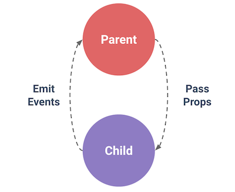

# # 什么是组件

组件 (Component) 是 Vue.js 最强大的功能之一。组件可以扩展 HTML 元素，封装可重用的代码。在较高层面上，组件是自定义元素，Vue.js 的编译器为它添加特殊功能。在有些情况下，组件也可以表现为用 `is` 特性进行了扩展的原生 HTML 元素。

# # 使用组件

## 1、全局注册

```html
<div id="app">
    <my-component></my-component>
</div>
```

```javascript
// 全局注册组件
Vue.component('my-component', {
    template: '<p>A custom component!</p>'
})
// 创建根实例
let vm = new Vue({
    el: '#app',
})
```

渲染为：

```html
<div id="app">
    <p>A custom component!</p>
</div>
```

> 提示：全局组件可应用于所有 vue 实例。

## 2、局部注册

```html
<div id="app">
    <my-component></my-component>
</div>
```

```javascript
let child = {
    template: '<p>A custom component!</p>'
}
let vm = new Vue({
    el: '#app',
  	// 局部注册组件
    components: {
        'my-component': child
    }
})
```

> 提示：局部组建只能在当前 vue 实例中使用。

## 3、DOM 模板解析注意事项

当使用 DOM 作为模板时 (例如，使用 `el` 选项来把 Vue 实例挂载到一个已有内容的元素上)，你会受到 HTML 本身的一些限制，因为 Vue 只有在浏览器解析、规范化模板**之后**才能获取其内容。尤其要注意，像 `<ul>`、`<ol>`、`<table>`、`<select>` 这样的元素里允许包含的元素有限制，而另一些像 `<option>` 这样的元素只能出现在某些特定元素的内部。

在自定义组件中使用这些受限制的元素时会导致一些问题，例如：

```html
<table>
 	 <my-row>...</my-row>
</table>
```

自定义组件 `<my-row>` 会被当作无效的内容，因此会导致错误的渲染结果。变通的方案是使用特殊的 `is` 特性：

```
<table>
  	<tr is="my-row"></tr>
</table>
```

**应当注意，如果使用来自以下来源之一的字符串模板，则没有这些限制：**

- `<script type="text/x-template">`
- JavaScript 内联模板字符串
- `.vue` 组件

因此，请尽可能使用字符串模板。

## 4、data 必须是函数

构造 Vue 实例时传入的各种选项大多数都可以在组件里使用。只有一个例外：`data` 必须是函数。实际上，如果你这么做：

```javascript
Vue.component('my-component', {
  	template: '<span>{{ message }}</span>',
  	data: {
  	 	 message: 'Hello, vue.js!'
  	}
})
```

那么 Vue 会停止运行，并在控制台发出警告，告诉你在组件实例中 `data` 必须是一个函数。但理解这种规则为何存在也是很有益处的，所以让我们先作个弊：

```html
<div id="app">
    <my-component></my-component>
    <my-component></my-component>
    <my-component></my-component>
</div>
```

```javascript
let data = {
    counter:0
}
let vm = new Vue({
   el: "#app",
   components: {
       "my-component": {
           template: "<button type='button' @click='counter += 1'> {{ counter }}</button>",
           data: function () {
               return data
           }
       }
   }
});
```

[查看demo](https://lihongyao.github.io/tutorials/vue/02.Components/data-error.html)

由于这三个组件实例共享了同一个 `data` 对象，因此递增一个 counter 会影响所有组件！这就错了。我们可以通过为每个组件返回全新的数据对象来修复这个问题：

```javascript
data: function () {
  	return {
   		 counter: 0
 	}
}
```

现在每个 counter 都有它自己内部的状态了：

[查看demo](https://lihongyao.github.io/tutorials/vue/02.Components/data.html)

## 5、组件组合

组件设计初衷就是要配合使用的，最常见的就是形成父子组件的关系：组件 A 在它的模板中使用了组件 B。它们之间必然需要相互通信：父组件可能要给子组件下发数据，子组件则可能要将它内部发生的事情告知父组件。然而，通过一个良好定义的接口来尽可能将父子组件解耦也是很重要的。这保证了每个组件的代码可以在相对隔离的环境中书写和理解，从而提高了其可维护性和复用性。

在 Vue 中，父子组件的关系可以总结为 **prop 向下传递，事件向上传递**。父组件通过 **prop**给子组件下发数据，子组件通过**事件**给父组件发送消息。看看它们是怎么工作的。




# # Prop

prop 是父组件用来传递数据的一个自定义属性。

父组件的数据需要通过 props 把数据传给子组件，子组件需要显式地用 props 选项声明 "prop"：

## 1、使用 Prop 传递数据

```html
<div id="app">
    <my-component message="Hello"></my-component>
</div>
```

```javascript
// 注册组件
Vue.component('my-component', {
    // 声明 props
    props: ['message'],
    // 同样也可以在 vm 实例中像 "this.message" 这样使用
    template: '<p>{{ message }}</p>'
})
// 创建根实例
var app = new Vue({
    el: '#app'
})
```

## 2、动态 Prop

类似于用 v-bind 绑定 HTML 特性到一个表达式，也可以用 v-bind 动态绑定 props 的值到父组件的数据中。每当父组件的数据变化时，该变化也会传导给子组件：

```html
<div id="app">
    <form action="" name="myForm">
        <input type="text" v-model="parentMsg">
    </form>
    <my-component v-bind:message="parentMsg"></my-component>
</div>
```

```javascript
// 注册组件
Vue.component('my-component', {
    // 声明 props
    props: ['message'],
    // 同样也可以在 vm 实例中像 "this.message" 这样使用
    template: '<p>{{ message  }}</p>'
})
// 创建根实例
var app = new Vue({
    el: '#app',
    data: {
        parentMsg: '父组件内容...'
    }
})
```


## 3、Prop 验证

我们可以为组件的 prop 指定验证规则。如果传入的数据不符合要求，Vue 会发出警告。这对于开发给他人使用的组件非常有用。

要指定验证规则，需要用对象的形式来定义 prop，而不能用字符串数组：

```javascript
Vue.component('example', {
    props: {
        // 基础类型检测 (`null` 指允许任何类型)
        propA: Number,
        // 可能是多种类型
        propB: [String, Number],
        // 必传且是字符串
        propC: {
            type: String,
            required: true
        },
        // 数值且有默认值
        propD: {
            type: Number,
            default: 100
        },
        // 数组/对象的默认值应当由一个工厂函数返回
        propE: {
            type: Object,
            default: function () {
                return { message: 'hello' }
            }
        },
        // 自定义验证函数
        propF: {
            validator: function (value) {
                return value > 10
            }
        }
    }
})
```

`type` 可以是下面原生构造器：

- String
- Number
- Boolean
- Function
- Object
- Array
- Symbol

`type` 也可以是一个自定义构造器函数，使用 `instanceof` 检测。

当 prop 验证失败，Vue 会抛出警告 (如果使用的是开发版本)。注意 prop 会在组件实例创建**之前**进行校验，所以在 `default` 或 `validator` 函数里，诸如 `data`、`computed` 或 `methods` 等实例属性还无法使用。

# # 自定义事件

父组件是使用 props 传递数据给子组件，但如果子组件要把数据传递回去，就需要使用自定义事件！

我们可以使用 v-on 绑定自定义事件, 每个 Vue 实例都实现了事件接口(Events interface)，即：

- 使用 `$on(eventName)` 监听事件
- 使用 `$emit(eventName)` 触发事件

另外，父组件可以在使用子组件的地方直接用 v-on 来监听子组件触发的事件。


